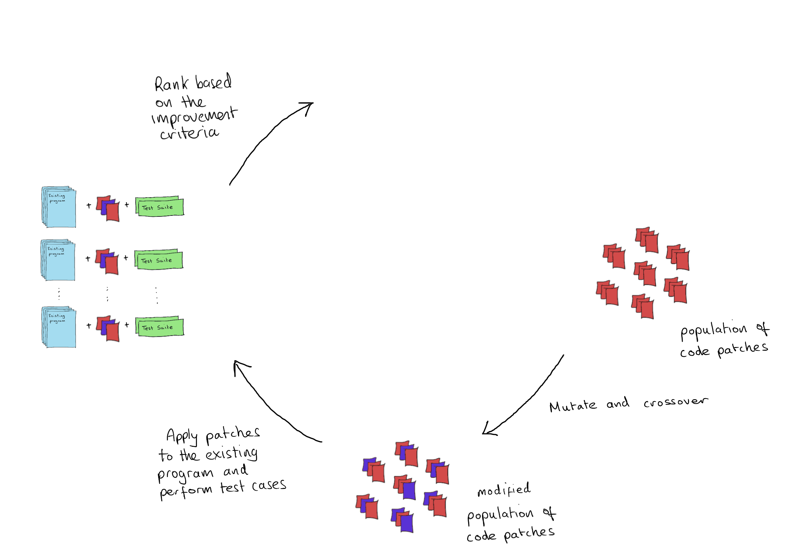

<!-- .slide: data-state="no-toc-progress" --> <!-- don't show toc progress bar on this slide -->

# Genetic Improvement
<!-- .element: class="no-toc-progress" --> <!-- slide not in toc progress bar -->

### Revolutionising programming or just fixing bugs?

By [Fraser Garrow](https://github.com/frsrgrrw) | 18-11-2020

----  ----

## 1. What is GI?

----

## What is GI?

* <!-- .element: class="fragment" -->  Genetic Programming
 

* <!-- .element: class="fragment" --> Search Based Software Engineering

<!-- .element: class="fragment" --> With GI the idea is to improve **EXISTING PROGRAMS** by genetic programming

----  ----

## 2. What are we improving?

----

## What are we improving?

<!-- .element: class="fragment" -->code functionality

<!-- .element: class="fragment" -->i.e. maintaining correct output (bug-fixing)
* <!-- .element: class="fragment" --> new functionality or feature
* <!-- .element: class="fragment" --> time or space efficiency
* <!-- .element: class="fragment" --> power consumption

----  ----

## 3. Why is this useful?

----

## Why is this useful?

<!-- .element: class="fragment" -->code maintenance is an expensive process. Industry is already using GI for maintenance [[1]][facebook].

<!-- .element: class="fragment" -->there is lots of computer programs already written, we don't need to start from scratch.

<!-- .element: class="fragment" -->computers are good at optimising for criteria that humans are not so good at.

[facebook]: #/12

----  ----

## 4. How does it work?

----

<!-- .slide: data-transition="none" --> 
## How does it work?

----

<!-- .slide: data-transition="none" --> 
## How does it work?

----

<!-- .slide: data-transition="none" --> 
## How does it work?

----

<!-- .slide: data-transition="none" -->
## How does it work?

----

<!-- .slide: data-transition="none" -->
## How does it work?

----

<!-- .slide: data-transition="none" -->
## How does it work?

----

<!-- .slide: data-transition="none" -->
## How does it work?

----

<!-- .slide: data-transition="none" -->
## How does it work?

----

<!-- .slide: data-transition="none" -->
## How does it work?

----

<!-- .slide: data-transition="none" -->
## How does it work?

----  

<!-- .slide: data-transition="none" --> 
## How does it work?

----

<!-- .slide: data-transition="none" --> 
## How does it work?

----

<!-- .slide: data-transition="none" --> 
## How does it work?

----

<!-- .slide: data-transition="none" -->
## How does it work?

----

<!-- .slide: data-transition="none" -->
## How does it work?

----

<!-- .slide: data-transition="none" -->
## How does it work?

----

<!-- .slide: data-transition="none" -->
## How does it work?

----

<!-- .slide: data-transition="none" -->
## How does it work?

----  ----

## 5. Representation

----

## Representation

* <!-- .element: class="fragment" --> Grammar based encoding
* <!-- .element: class="fragment" --> Syntax trees

<!-- .element: class="fragment" --> These can help ensure evolved programs are *correct*, but programs are less fragile than we think [[2]][fragile]
* <!-- .element: class="fragment" -->Source code - simple and convenient

[fragile]: #/12

----  ----

## 6. Code Patches

----

## Code Patches

Code patches are just a list of edits that we apply to the existing program to create a new program

<!-- .element: class="fragment" --> So, what is an edit?

* <!-- .element: class="fragment" --> `Insert(location, code)`
* <!-- .element: class="fragment" --> `Remove(location)`
* <!-- .element: class="fragment" --> `Replace(location, code)`

----  ----

## 7. Genetic Material

----

## Genetic Material

* <!-- .element: class="fragment" --> Code transplants from the existing program (we repeat code lots) 
* <!-- .element: class="fragment" --> Derived from the grammar or allowable list of operators
* <!-- .element: class="fragment" --> Code transplants from outside sources – GitHub, StackOverflow, SourceForge, GitLab, BitBucket etc. (there is an abundance of code available)
  * <!-- .element: class="fragment" --> lots of hype about this [[3]][wired].

[wired]: #/12

----  ----

## 8. Improvement Criteria (again)

----

## Improvement Criteria

1. <!-- .element: class="fragment" --> Functional Properties
  * <!-- .element: class="fragment" --> Functionality and correct output, the features and normal usage
2. <!-- .element: class="fragment" --> Non-Functional Properties
  * <!-- .element: class="fragment" --> memory usage, execution time, power-usage, etc.. Things we might consider difficult for a human to optimise

----

## Improvement Criteria

The non-functional properties of programs are becoming increasingly more important as move away from the era of desktop computing.

<!-- .element: class="fragment" --> With GI we can create programs that explore trade-offs between properties.

----

## Improvement Criteria

When might me want to be less ‘correct’ but more efficient?

<!-- .element: class="fragment" --> When we consider things like mobile computing or robots we can easily think of scenarios where it might be preferable to do a job with reduced functionality if it means increased battery life.

<!-- .element: class="fragment" --> In mobile computing all of the functionality depends on the ability to sustain battery power, if this runs out there is no functionality.

----  ----

## 9. Case Studies

----

## Case Studies - Bug Fixing

* Industrial use case: Facebook Engineering
* Fixing Bugs in Your Sleep: How Genetic Improvemnt Became an Overnight Success. Haroldsson et al. [[4]][bugs]

  * <!-- .element: class="fragment" --> Found and Fixed 22 bugs
  * <!-- .element: class="fragment" --> all done during downtime

[bugs]: #/12

----

## Case Studies - Energy Consumption

* Reducing Energy Consumption Using Genetic Improvement. Bruce et al., [[5]][minisat]

  * <!-- .element: class="fragment" --> Reduced energy consumption by up to 25%

[minisat]: #/12

----

## Case Studies - Execution Time

* Improving 3D medical image registration CUDA software with genetic programming, Langdon et al., [[6]][cuda1]
  * Speed up of over 35%

* Improving CUDA DNA Analysis Software with Genetic Programming, Langdon et al., [[7]][cuda2]
  * 100 times speed up

* <!-- .element: class="fragment" --> Optimizing Existing Software With Genetic Programming, Langdon and Harman [[8]][gip]
  * <!-- .element: class="fragment" --> 70 times faster (and higher accuracy)

[cuda1]: #/12

[cuda2]: #/12

[gip]: #/12

----

## Case Studies - SLAM

* Novelty search for software improvement of a SLAM system, López-López et al., [[9]][slam]

  * <!-- .element: class="fragment" --> GI system to improve both functional and non-functional properties of a SLAM system
  * <!-- .element: class="fragment" --> realtive success with improvements of 26.3% and 12.5% being made for the functional (accuracy) and non-functional (speed) properties, respectively.

[slam]: #/12

----  ----

## 10. The Future of GI

----

## The Future of GI

* <!-- .element: class="fragment" --> Self-adaptive systems
* <!-- .element: class="fragment" --> Programs that can be tuned for specific purposes, maybe one day it has to be faster than it is accurate and vice versa

----  ----

## Try it yourself

* [PyGGI]() [[10]][pyggi]
* [GIN]() [[11]][gin]

[pyggi]: #/12
[gin]: #/12
